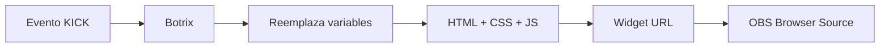

<div align="center">

# Alertas RocKG

**Pack de alertas personalizadas para KICK · Botrix · OBS**

Marco angular rojo, tipografía bold italic y animaciones listas para stream.

[](https://developer.mozilla.org/es/docs/Web/HTML)
[](https://developer.mozilla.org/es/docs/Web/CSS)
[](https://developer.mozilla.org/es/docs/Web/JavaScript)
[](https://kick.com)
[](https://obsproject.com)

[Ver preview local](#-preview-local) · [Instalar en Botrix](#-instalación-en-botrix) · [Documentación técnica](#-documentación-técnica)

</div>

---

## Sobre el proyecto

Repositorio de **ejemplo público** con el set completo de alertas del canal **RocKG** en [KICK](https://kick.com). Cada evento del stream — follow, sub, gift, host, propina y KICKs — tiene su propio diseño coherente con la identidad visual del canal.

El código está organizado para que puedas:

- **Previsualizar** todas las alertas en el navegador, sin conectar Botrix
- **Copiar y pegar** HTML, CSS y JS directamente en el panel de Botrix
- **Entender** cómo se estructura una alerta custom para KICK + OBS
- **Adaptar** colores, textos y animaciones a otro canal

> Las imágenes (emotes, logo, mascota) se suben desde el panel de Botrix. No están incluidas en este repositorio.

---

## Paleta RocKG

| | Color | Uso |
|:---:|:---:|-----|
| 🔴 | `#FF0000` | Borde, acentos, glow principal |
| ⬛ | `#0A0A0A` | Fondo del marco con textura grain |
| ⬜ | `#FFFFFF` | Títulos y nombre del viewer |
| 🟡 | `#FFD700` | Acento en subs, gifts y KICKs |

**Tipografía:** [Montserrat Black Italic](https://fonts.google.com/specimen/Montserrat) · fallback `Arial Black`

**Formas:** marco con esquinas cortadas (`clip-path`), rayos angulares 3D y pulso de borde en alertas premium.

---

## Alertas incluidas

| Evento | Carpeta | Título | Variables extra |
|--------|---------|--------|-----------------|
| Seguidores | [`botrix/follow/`](botrix/follow/) | ¡NUEVO SEGUIDOR! | `{name}` |
| Suscripción | [`botrix/sub/`](botrix/sub/) | ¡NUEVA SUB! | `{name}`, `{message}` |
| Sub regalada | [`botrix/gift/`](botrix/gift/) | ¡REGALÓ SUBS! | `{name}`, `{amount}`, `{message}` |
| Host | [`botrix/host/`](botrix/host/) | ¡NUEVO HOST! | `{name}`, `{amount}` |
| Propina | [`botrix/tip/`](botrix/tip/) | ¡DONACIÓN! | `{name}`, `{amount}`, `{message}` |
| KICKs | [`botrix/kicks/`](botrix/kicks/) | ¡KICKS RECIBIDOS! | `{name}`, `{amount}` |

Cada carpeta contiene:

```
botrix/follow/
├── html.html      → Estructura HTML + variables Botrix
├── css.css        → Estilos, animaciones y variables CSS
├── js.js          → Correcciones de layout en runtime
└── preview.html   → Vista previa con datos de ejemplo
```

Los archivos `botrix/*.html` en la raíz de `botrix/` son versiones combinadas de referencia.

---

## Tecnologías

| Capa | Tecnología | Rol en el proyecto |
|------|------------|-------------------|
| Marcado | **HTML5** | Estructura semántica de cada alerta y placeholders Botrix (`{name}`, `{img}`, etc.) |
| Estilos | **CSS3** | Custom properties, `clip-path`, `@keyframes`, gradientes, sombras y responsive al widget |
| Lógica | **JavaScript** (vanilla ES5) | IIFE, `MutationObserver`, corrección de layout y deduplicación de nombres |
| Fuentes | **Google Fonts** | Montserrat Black Italic vía `@import` |
| Widget | **[Botrix](https://botrix.live)** | Plataforma de alertas para KICK con soporte de custom code |
| Overlay | **[OBS Studio](https://obsproject.com)** | Browser Source con CSS transparente (`obs-custom-css.txt`) |
| Plataforma | **[KICK](https://kick.com)** | Destino del stream y origen de los eventos |

No hay dependencias externas, bundlers ni frameworks. Todo es código plano listo para pegar.

---

## Estructura del repositorio

```
Alertas-RocKG/
│
├── botrix/                    # Código de producción para Botrix
│   ├── follow/  sub/  gift/
│   ├── host/    tip/   kicks/
│   └── *.html                 # Referencia combinada por tipo
│
├── previews/                  # Galería local sin Botrix
│   ├── todas-las-alertas.html
│   ├── preview-theme.css      # Tema de la galería
│   └── preview-helper.js      # Botón "Reproducir" en previews
│
└── obs-custom-css.txt         # Fondo transparente para OBS
```

---

## Preview local

Clona el repo y abre en tu navegador:

```
previews/todas-las-alertas.html
```

Verás las **6 alertas** con datos simulados. También puedes abrir cada `preview.html` por separado o usar el botón **↻ Reproducir** para reiniciar la animación.

---

## Instalación en Botrix

### Requisitos previos

1. Cuenta en [botrix.live](https://botrix.live) → **Login with Kick**
2. El bot `botrixlive` debe ser **moderador** en tu canal KICK

### Pasos por cada alerta

```
Settings → Alerts → [pestaña del evento]
```

1. **Sube la imagen** del emote o logo (botón verde de upload)
2. **Campo de texto del panel** → déjalo vacío o pon `-`. El título ya está en el HTML; el nombre viene de `{name}`. No repitas `{name}` en el panel o se duplicará.
3. **Custom Code** → pega el contenido de la carpeta:

| Campo Botrix | Archivo |
|--------------|---------|
| Html | `html.html` |
| CSS | `css.css` |
| JavaScript | `js.js` |
| Campos personalizados | no modificar |

4. **Exportar esta Alerta** → **Test Alert**
5. Copia la **Widget URL** → OBS → **Browser Source**

### Variables Botrix

```
{name}        → Nombre del viewer
{text}        → Texto principal
{message}     → Mensaje adicional
{amount}      → Cantidad (subs, propina, viewers, KICKs)
{img}         → Imagen/GIF — usar dentro de .alert-media (NO {image})
{sound}       → Sonido (configurado en el panel)
{animation}   → Clase de animación en .rockg-line2
{disposition} → Layout en .container
{transition}  → Transición en .container
```

### Ajustes del panel recomendados

| Opción | Valor |
|--------|-------|
| Disposición | Imagen izquierda · texto derecha |
| Animación de entrada | Fade o Slide |
| Duración | ~6 segundos |
| Fuente / color del panel | Irrelevante — el CSS custom lo sobreescribe |

---

## Configuración en OBS

| Campo | Valor |
|-------|-------|
| Ancho | `800` |
| Alto | `200` |
| FPS | `30` |
| Actualizar navegador cuando la escena esté activa | ✓ |
| CSS personalizado | Pegar `obs-custom-css.txt` |

Después de editar código en Botrix: clic derecho en la fuente → **Actualizar**.

---

## Documentación técnica

### Arquitectura de una alerta



### Estructura HTML

Todas las alertas comparten el mismo esqueleto:

```html
<div class="container rockg-alert {disposition} {transition}">
  <div class="rockg-frame">
    <div class="alert-media-container rockg-media">
      <div class="alert-media">{img}</div>
    </div>
    <div class="alert-text-container rockg-text-wrap">
      <div class="alert-text">
        <div id="alert-message">
          <span class="rockg-tag">RocKG</span>
          <h3 class="rockg-line1">¡TÍTULO!</h3>
          <span class="rockg-line2 {animation}">{name}</span>
        </div>
      </div>
    </div>
  </div>
</div>
```

Las alertas con cantidad (`gift`, `tip`, `host`, `kicks`) añaden `.rockg-amount` con `{amount}`. Las que admiten mensaje libre incluyen `#custom-message` con `{message}`.

### Clases CSS principales

| Clase | Función |
|-------|---------|
| `.container.rockg-alert` | Contenedor raíz; define variables `--rock-red`, `--rock-black`, etc. |
| `.rockg-frame` | Marco visual con borde, sombra, `clip-path` y animación de entrada |
| `.rockg-tag` | Etiqueta "RocKG" sobre el título |
| `.rockg-line1` | Título fijo de la alerta (ej. ¡NUEVA SUB!) |
| `.rockg-line2` | Nombre del viewer con animación `{animation}` |
| `.rockg-amount` | Bloque de cantidad numérica |
| `.rockg-msg` | Mensaje opcional del viewer |

Modificadores por tipo: `.rockg-alert--sub`, `.rockg-alert--gift`, `.rockg-alert--tip`, etc.

### JavaScript (`js.js`)

Cada alerta ejecuta un **IIFE** que:

1. Fuerza fondo transparente en `html` y `body` (necesario para OBS)
2. Corrige el layout que Botrix puede alterar (`float`, tamaños de imagen)
3. Normaliza imágenes a **72×72 px** con `object-fit: contain`
4. Elimina nombres duplicados si Botrix los inyecta dos veces (`dedupeName`)
5. Observa cambios en el DOM con **`MutationObserver`** y reaplica correcciones
6. Oculta `#custom-message` si `{message}` llega vacío (en alertas que lo usan)

### Animaciones CSS

| Alerta | Animaciones destacadas |
|--------|------------------------|
| Follow | `rockgFrameIn`, pulso de borde rojo |
| Sub | `rockgSubFrameIn`, `rockgSubBorderPulse`, acento dorado |
| Gift | Entrada con escala + brillo en cantidad |
| Host / Tip / KICKs | Variantes del frame base con timing propio |

Todas usan `cubic-bezier` para entradas elásticas y `!important` para ganar especificidad frente a los estilos por defecto de Botrix.

### Previews locales

| Archivo | Descripción |
|---------|-------------|
| `preview-theme.css` | Tema oscuro cyberpunk para la galería y HUD de preview |
| `preview-helper.js` | Detecta `?embed=1` y habilita el botón de reproducción |
| `preview.html` | Simula el widget Botrix a 800×200 con datos estáticos |

---

## Personalización

| Qué cambiar | Dónde |
|-------------|-------|
| Colores de marca | Variables `--rock-*` en cada `css.css` |
| Títulos y tag | `.rockg-line1` y `.rockg-tag` en `html.html` |
| Imágenes | Panel de Botrix (no rutas en código) |
| Duración / timing | `@keyframes` y `animation` en `css.css` |
| Sonidos | Panel de Botrix por alerta |

Haz fork, edita y repite la instalación pestaña por pestaña.

---

## Solución de problemas

| Síntoma | Solución |
|---------|----------|
| Se ve bien en Test Alert pero mal en OBS | Revisa tamaño 800×200 y pega `obs-custom-css.txt` |
| Nombre duplicado | Vacía el campo de texto del panel; no uses `{name}` ahí |
| Doble imagen o texto | Usa solo custom code; desactiva estilos del panel |
| Imagen no aparece | Usa `{img}`, nunca `{image}` |
| Alerta recortada | Aumenta el Browser Source a mínimo 800×200 |
| Fuente incorrecta | Si Google Fonts no carga, el fallback es Arial Black |
| Cambios no se reflejan | Exporta la alerta en Botrix y actualiza la fuente OBS |

---

## Licencia y uso

Proyecto de ejemplo publicado como referencia open source. Puedes estudiarlo, hacer fork y adaptarlo libremente. Un crédito al repositorio se agradece.

---

<div align="center">

**RocKG** · Alertas para KICK

[Botrix](https://botrix.live) · [KICK](https://kick.com) · [OBS Studio](https://obsproject.com)

</div>
